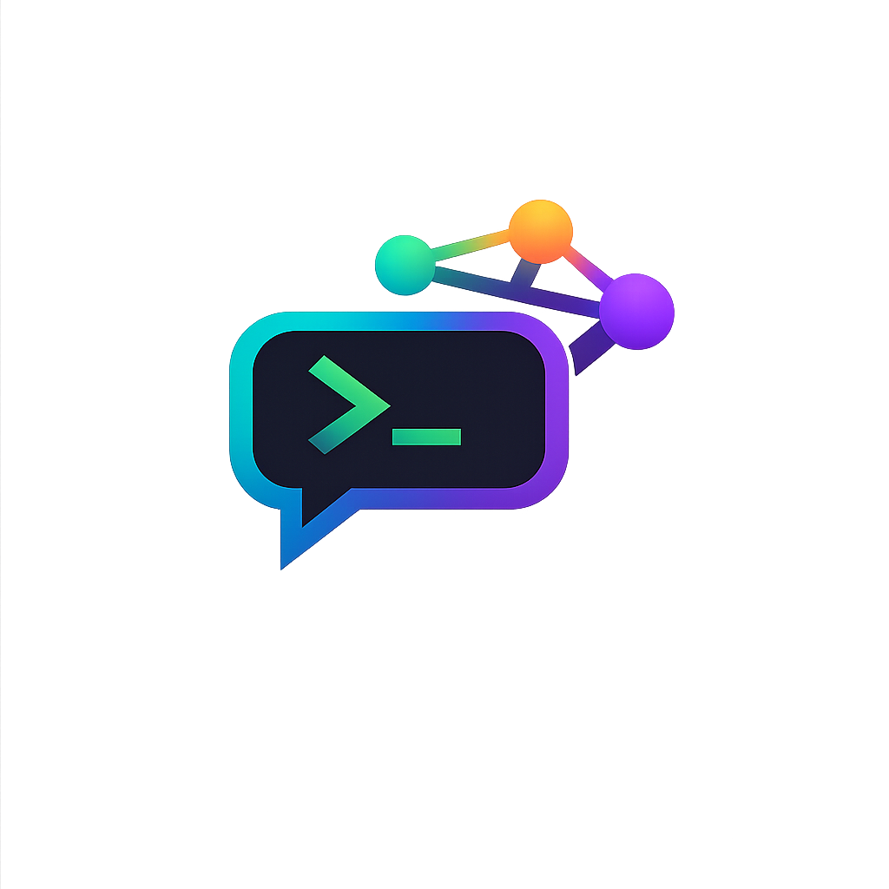
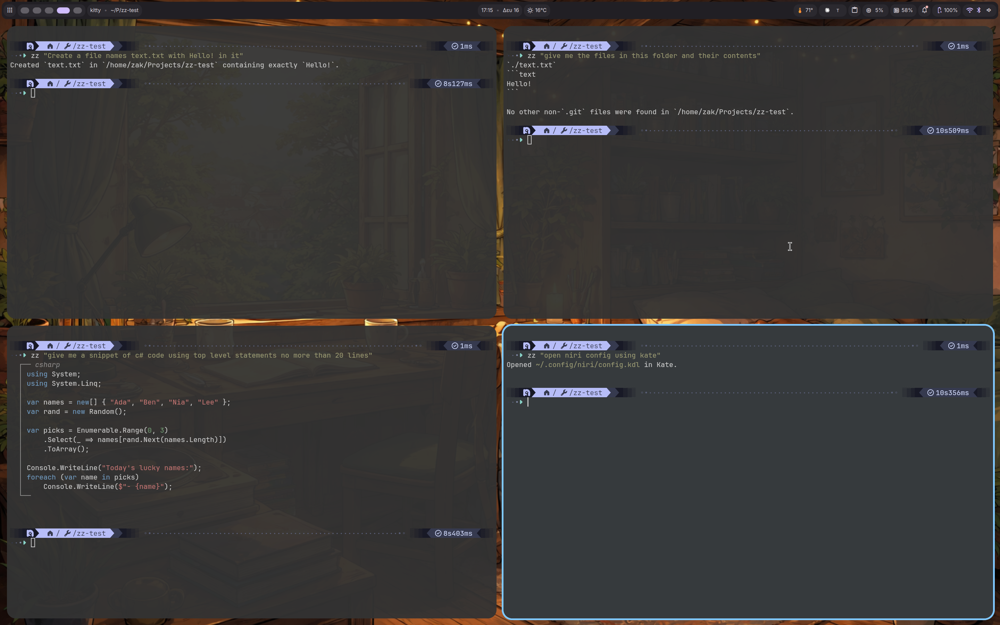

<p align="center">
  
</p>

<h1 align="center">zz</h1>

<p align="center">
  A lightweight terminal interface for conversational <a href="https://openai.com/index/openai-codex/">Codex</a> sessions.
</p>

<p align="center">
  = 18">
  
  
</p>

---

## Why zz?

A lightweight alternative to [GitHub Copilot CLI](https://cli.github.com/) or [tAI](https://github.com/bjarneo/tAI) — no external API keys needed, just reuse your existing Codex subscription.

<p align="center">
  
</p>

## Quick Start

```sh
# Install
curl -fsSL https://raw.githubusercontent.com/zakstam/codex-headless-cli/main/install.sh | bash

# Run
zz "explain this codebase"
```

## Features

- **Streaming output** — responses appear token-by-token as they're generated
- **Markdown rendering** — headings, bold, italic, lists, links, and code blocks rendered natively in the terminal
- **Syntax highlighting** — fenced code blocks highlighted with language-aware coloring
- **Animated reasoning display** — watch the model think in real-time with a shimmer animation
- **Command approval** — review and approve/deny commands before they run
- **Configurable sandboxing** — read-only, workspace-write, or full-access modes
- **No API keys** — powered by your Codex subscription, no separate OpenAI key required

## Prerequisites

- **Node.js** >= 18
- **Codex CLI** binary installed and on your `PATH` ([install instructions](https://github.com/openai/codex))
- **Logged in to Codex CLI** — run `codex login` before using zz

## Install

```sh
curl -fsSL https://raw.githubusercontent.com/zakstam/codex-headless-cli/main/install.sh | bash
```

This makes `zz` available globally. On first run it launches a setup wizard.

## Usage

### Interactive REPL

```sh
zz
```

Opens a conversational session. Commands inside the REPL:

| Command      | Action                          |
|--------------|---------------------------------|
| `/help`      | Show available commands         |
| `/interrupt` | Interrupt the current turn      |
| `/exit`      | Exit the REPL                   |
| `i`          | Interrupt current turn          |
| `Ctrl+C`     | Interrupt current turn, or exit |

### Single-Shot Query

```sh
zz list all TypeScript files in this project
```

Runs the query, streams the response, then exits.

### Re-Run Setup Wizard

```sh
zz --setup
```

<details>
<summary><h2>Configuration</h2></summary>

Stored at `~/.config/zz/config.json`. Created automatically on first run or with `--setup`.

```jsonc
{
  "model": "GPT-5.3-Codex-Spark",  // model name (fetched from codex on setup)
  "approvalMode": "prompt",        // "auto-approve" | "prompt" | "deny"
  "sandbox": "workspace-write",    // "read-only" | "workspace-write" | "full-access"
  "reasoningOnly": false,          // true = show thinking, omit response text
  "codexBin": ""                   // custom path to codex binary (optional)
}
```

### Options

| Field           | Values                                              | Description                                                        |
|-----------------|-----------------------------------------------------|--------------------------------------------------------------------|
| `model`         | Any model returned by `codex model/list`            | Which model to use. The wizard fetches the list from codex.        |
| `approvalMode`  | `prompt`, `auto-approve`, `deny`                    | How to handle command/file-change approval requests.               |
| `sandbox`       | `read-only`, `workspace-write`, `full-access`       | Sandbox restrictions. Use `full-access` for GUI apps or system commands. |
| `reasoningOnly` | `true`, `false`                                     | Show only the model's reasoning, suppress the response text.       |
| `codexBin`      | file path                                           | Override the path to the `codex` binary.                           |

</details>

## Development

```sh
npm run dev          # run with tsx --watch (auto-reload)
npm run start        # run once via tsx
npm run build        # compile to dist/
```

<details>
<summary><h2>How It Works</h2></summary>

zz wraps `CodexLocalBridge` from [`@zakstam/codex-local-component`](https://www.npmjs.com/package/@zakstam/codex-local-component), which spawns `codex app-server` as a child process and communicates over JSON-RPC on stdin/stdout. The CLI handles the protocol lifecycle (initialize, thread start, turn management) and renders events to the terminal:

- **Reasoning** is displayed as an animated single-line status that replaces itself as new thoughts arrive
- **Response text** streams with full markdown rendering — headings, lists, inline formatting, and syntax-highlighted code blocks
- **Command output** (stdout/stderr from executed commands) streams in dim text
- **Approval requests** show the command/file details and prompt for confirmation (or auto-approve/deny per config)

</details>

## License

[MIT](LICENSE)
